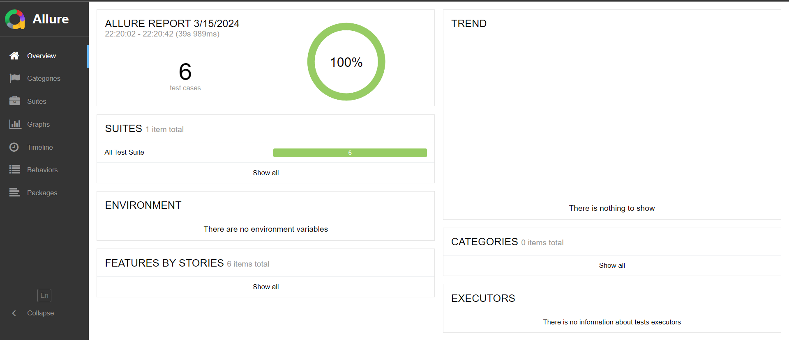
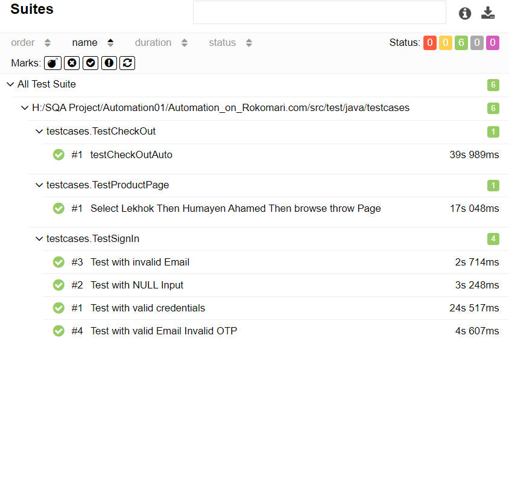

# Automation_on_Rokomari.com

# Web Automation Testing Project with Selenium (Java)

Welcome to the Web Automation Testing project using Selenium in Java! This project focuses on automating various web elements and actions on the Rokomari website. The aim is to streamline and enhance the testing process by automating tasks such as sign-up, navigation, filtering, adding to cart, shipping, and logging out.

## Project Overview

This project is designed to demonstrate the capabilities of Selenium in Java for web automation testing on the Rokomari website. By automating manual tasks, we aim to improve efficiency and accuracy in testing workflows.

## Features

### 1. Automated Web Elements Interaction
- Clicking, hovering, and scrolling functionalities are automated for seamless interaction with web elements.

### 2. Handling Iframes
- The project demonstrates the handling of iframes to interact with elements inside them.

### 3. OTP Handling
- Automation for handling OTPs, which is crucial for testing scenarios involving user authentication.

### 4. Tab Creation and Manipulation
- Automated tab creation and manipulation to simulate various user scenarios.

### 5. Window Handling
- Methods for creating, maximizing, minimizing, and handling multiple browser windows during testing.

## Setup and Installation

1. **Clone the repository:**

git clone https://github.com/imon742/Automation_on_Rokomari.com.git

2. **Install dependencies:**

// If using Maven
mvn clean install

markdown

3. **Set up environment:**

- Ensure you have Java JDK installed.
- Set up Selenium WebDriver and necessary drivers (e.g., ChromeDriver).

4. **Update configuration:**

- Update `config.properties` with your Google account credentials.

## Allure Reports

### Report 1

### Report 2

## Note

- Ensure you have a stable internet connection during test execution.
- Review the code and update it as needed based on changes in the Rokomari website's structure or functionality.

## Contributors

- [Nazmul Islam Emon](https://github.com/imon742)

## License

This project is licensed under the [MIT License](https://opensource.org/licenses/MIT)
